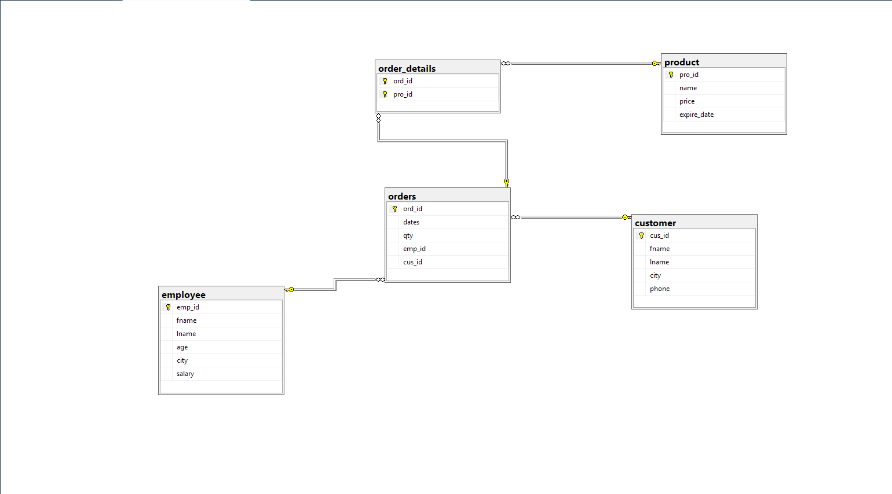

# SQL Practice Database

A relational database built with Microsoft SQL Server as part of a practice assignment.
Models a simple order management system with customers, employees, products, and orders.

## Database Diagram

## Tables

- **customer** – customer info (name, city, phone)
- **employee** – employee info (name, age, city, salary)
- **product** – product info (name, price, expiry date)
- **orders** – links customers and employees to purchases
- **order_details** – junction table linking orders to products

## How to Run

1. Open SQL Server Management Studio (SSMS)
2. Run `schema.sql` to create the tables
3. Run `data.sql` to insert the sample data

## Requirements

- Microsoft SQL Server
- SSMS or any SQL Server-compatible client
